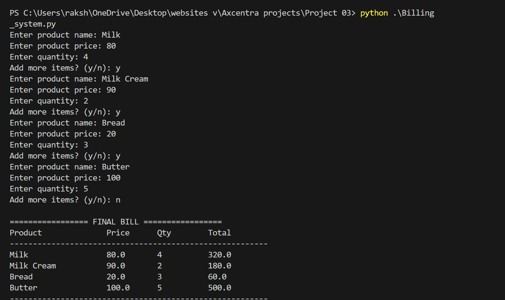

<h1 align="center">🧾 Billing System – Python (Console Based)</h1>

### 📌 Internship Project — Week 3  
**Company:** Axcentra  
**Intern:** *Vanshika Gupta*  

---

## 📖 Project Overview
This project is a **Console Based Billing System** developed in **Python** that allows users to generate bills by adding multiple products with price and quantity.  
It automatically calculates **Subtotal, GST (18%), and Grand Total** and displays a **formatted final bill**.

---

## 🚀 Features
✔ Add multiple products with price & quantity  
✔ Automatic calculation of **Subtotal, GST, and Grand Total**  
✔ **Clean and formatted bill output**  
✔ Beginner-friendly Python project  
✔ Useful for grocery stores, supermarkets & mini billing apps  

---

## 🛠️ Technologies Used
| Technology | Purpose |
|-----------|---------|
| Python | Core Programming |
| OOP Concepts | Product & Billing Classes |
| Console I/O | User Interaction |

---

## 📂 Project Structure

- **Billing_System/**
  - **Billing_system.py** — Main Python program file
  - **README.md** — Documentation file

---

## 🧾 Sample Output Screenshot
📌 Below is the final bill output after executing the project  

---
## 📌 Learning Outcomes
- Object-Oriented Programming in Python  
- Real-time calculation techniques  
- User input handling & formatted printing  
- Logic building for billing applications  

---

## 📄 Internship Information
| Details | Info |
|--------|------|
| **Intern Name** | **Vanshika Gupta** |
| **Company** | **Axcentra** |
| **Project Week** | **Week 3** |
| **Project Title** | **Billing System — Python** |

---

## 🏁 Conclusion
This project demonstrates a **real-world billing solution** using Python programming and OOP concepts.  
It helps understand how billing logic works inside **supermarket and store billing software** and builds a strong base for **real-time billing applications**.

---

## ✨ Developed By
👩‍💻 **Vanshika Gupta**  
Intern — **Axcentra**  
📌 *Week 3 Project*
